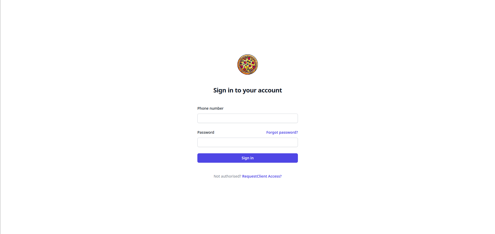
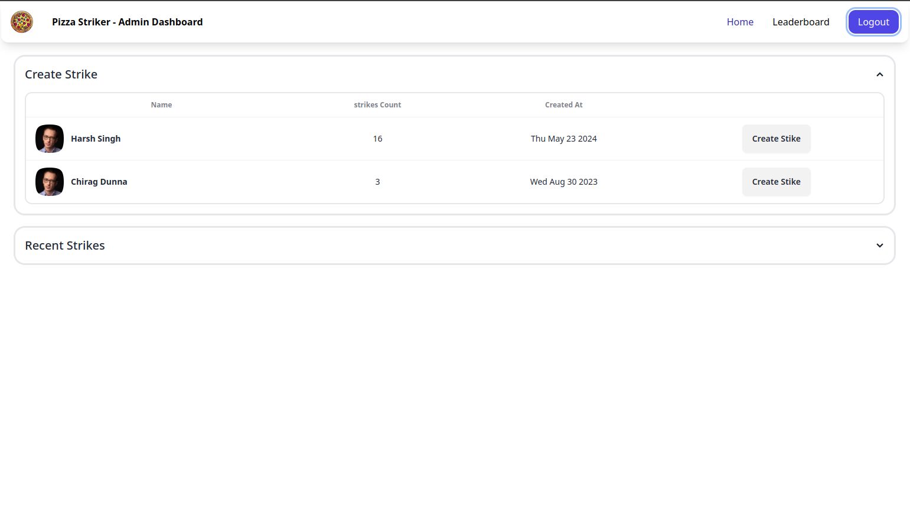
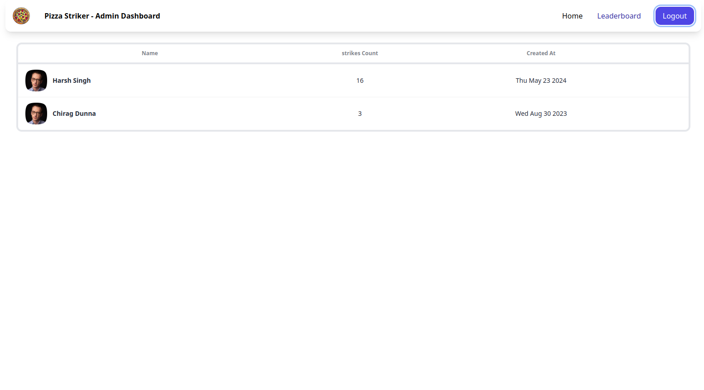
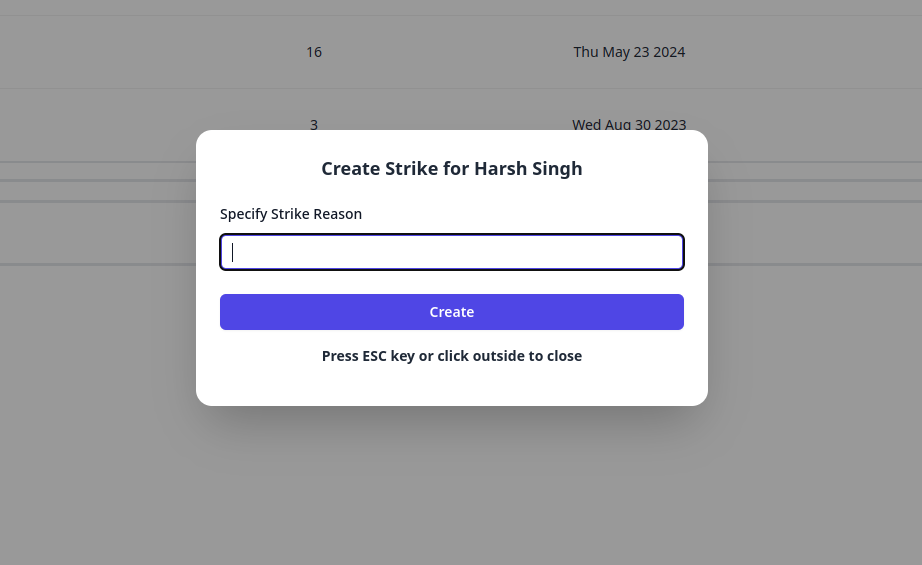

<h1 align="center" id="title">Pizza Striker Admin Dashboard Project</h1>

Welcome to my Fun Project! 🍕 (Pizza Striker Admin Dashboard). This project's frontend is built with React and utilizes React Router DOM for navigation. It interfaces with a FastAPI backend featuring JWT Authentication and PostgreSQL database.

<h2>Screenshots</h2>

#### Login Page

#### Homepage View

#### Leaderboard

#### Create Strike Dialog

<h2>Features</h2>

Here are some of the frontend's key features:

- **Responsive UI:** Designed with React for a responsive and intuitive user experience.

- **React Router DOM:** Utilizes React Router DOM for seamless navigation and routing within the application.

<h2>Built with</h2>

Technologies used in the frontend:

- [React](https://reactjs.org/)
- [React Router DOM](https://reactrouter.com/)

<h2>Project Repository</h2>

- [Backend Repository](https://github.com/Saurabh254/pizza_striker-backend)
- [Frontend Repository](https://github.com/Saurabh254/pizza_striker_admin)
